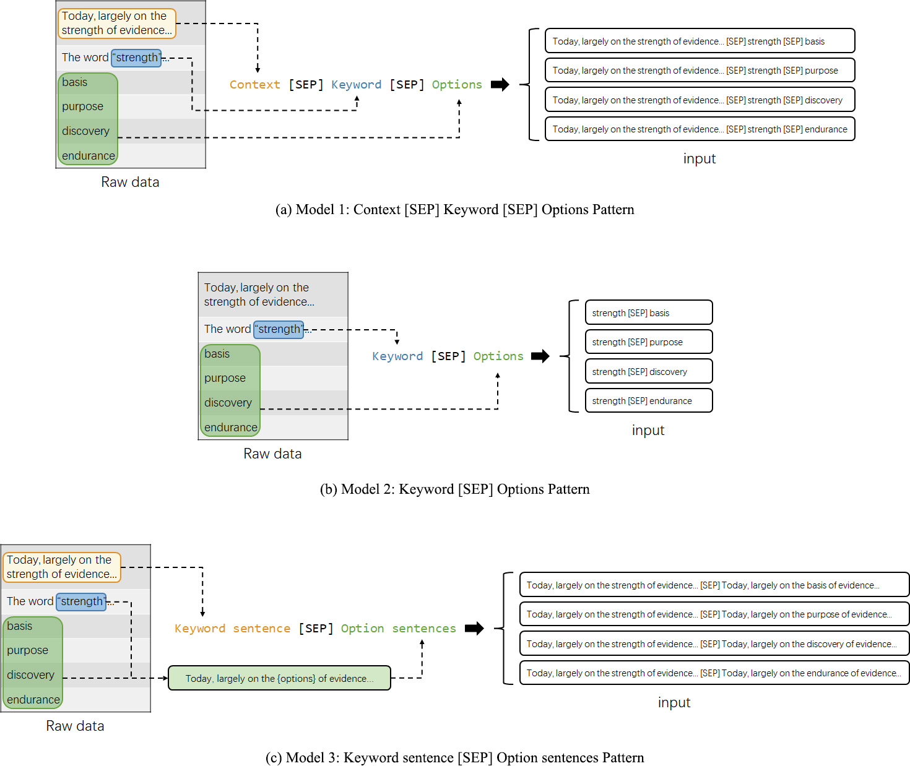
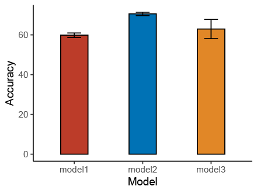
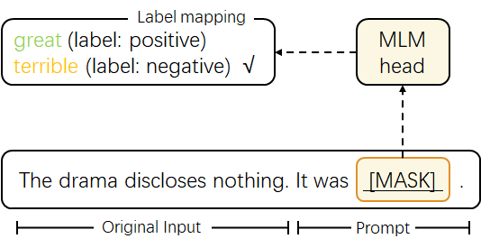
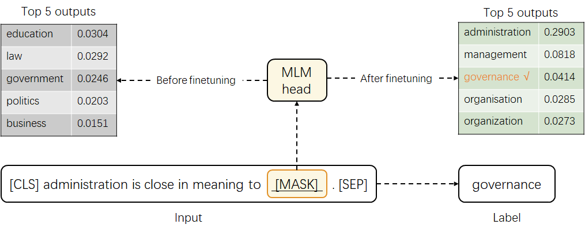

# Prompting: a zero-shot language model to process multiple-choice questions on synonyms

Multiple-choice questions are a classic section in exams. When taking a language test such as TOEFL®, some questions need you to select the "best" choice among a set of four options of words or phrases that are the closest meaning to a "keyword" in the context of a reading passage.

Here, I developed 2 kinds of language models to solve this problem. First is to use the `AutoModelForMultipleChoice` pre-trained model from [🤗TRANSFORMERS](https://huggingface.co/transformers). Second is to build a prompt for the model, so that this multiple-choice task can be formulated as a masked language modeling problem, which is what pre-trained models like BERT are designed for in the first place.

## Datasets

Two Datasets used in this project.

- A total of 454 synonym multiple-choice questions from TOEFL® test
- [WordNet](https://www.nltk.org/howto/wordnet.html)

Due to copyright issue, I can't share the TOEFL® test dataset here.

## Question structure

A typical example of synonym multiple-choice questions from TOEFL® test would be like this:

> 45\. Coincident with concerns about the accelerating loss of species and habitats has been a growing **appreciation** of the importance of biological diversity, the number of species in a particular ecosystem, to the health of the Earth and human well-being.  
>
> Q: The word "appreciation" is closest in meaning to which of following?  
>
> A. ignorance  
> B. recognition  
> C. tolerance  
> D. forgiveness
>
> Ans: B

It consists of 4 parts: Context, Question, 4 Options, and the Answer. We can easily handle those strings via Python's [`re`](https://docs.python.org/3/library/re.html) library to decode this structure and transform them into a structured data frame.

|   ID | Context                                                                                                                                                                                                                                                                                 | Question                                                               | Opt1      | Opt2      | Opt3          | Opt4        | Ans   |
|-----:|:----------------------------------------------------------------------------------------------------------------------------------------------------------------------------------------------------------------------------------------------------------------------------------------|:-----------------------------------------------------------------------|:----------|:----------|:--------------|:------------|:------|
|    0 | Most of these leaders were involved in public ...                                                                                            | The word "representative" is closest in meanin...  | typical   | satisfied | supportive    | distinctive | A     |
|    1 | In the United States, Louis Comfort Tiffany (1...                                                            | The word "prized" is closest in meaning to whi...         | valued    | universal | uncommon      | preserved   | A     |
|    2 | The Art Nouveau style was a major force in the... | The word "overtaken" is closest in meaning to ...      | surpassed | inclined  | expressed     | applied     | A     |
|    3 | During most of their lives, surge glaciers beh...                                                     | The word "intervals" is closest in meaning to ...      | records   | speeds    | distances     | periods     | D     |
|    4 | The increasing water pressure under the glacie...                  | The word "freeing" is closest in meaning to wh...        | pushing   | releasing | strengthening | draining    | B     |

## *AutoModelForMultipleChoice* model

This is a generic model class built in [🤗TRANSFORMERS](https://huggingface.co/transformers) that will be instantiated as one of the model classes of the library with a multiple-choice head. Read document [here](https://huggingface.co/transformers/model_doc/auto.html#automodelformultiplechoice).

I used **BERT** as the base model. Its input is a set of four arrays loaded in an array, and the output/label is the numeric version of the answer — namely encode [A, B, C, D] as [0, 1, 2, 3]. So we can try to build the input in 3 different patterns and make a comparison of which input pattern is better. See an illustration below.

### Building input patterns

There are 3 patterns of input we can try to build and then feed into the model:

1. `Context [SEP] Keyword [SEP] Options` - Model 1
1. `Keyword [SEP] Options` - Model 2
1. `Keyword sentence [SEP] Option sentences` - Model 3

<!-- 
Fig 1. Diagram of 3 input patterns
 -->
#### Fig 1. Diagram of 3 input patterns

### Finetune

I divided each dataset 70% as train data and 30% as test data with the same random seed. Each model was finetuned for 5 times.

### Results

See **Table 1** and **Figure 2** to see the mean results of accuracy for 3 models.

#### Table 1. Evaluation Metrics for 3 *AutoModelForMultipleChoice* Models

| Model | Training Loss | Validation Loss | Accuracy |
|-------|---|---|----------|
| 1     |  0.347900 | 0.886562  |    59.12%      |
| 2     |  0.549000  |0.880957   |     71.53%     |
| 3     |  0.365700 | 1.024703  |     62.04%     |

Model 2 (the *Keyword [SEP] Options* pattern) got the best result. Not only has it the highest accuracy but also is the most robust one that achieved almost consistent prediction performance when trained from different initializations.

<!-- 
Fig 2. Accuracy(%) of 3 Models
 -->
#### Fig 2. Accuracy(%) of 3 Models

It actually adheres to our intuitions that when doing synonym multiple-choice questions, sometimes we don't really have to read the context. By just examining the keyword and options, we can still select the best choice.

## Prompt model

This 70% of accuracy seems mediocre, but we can't raise its performance to the next level due to the lack of enough data for finetuning. However, as declared above, giving the context is kind of unnecessary, we may try to build a prompt to improve our model. Just by designing a template that combines synonyms, we can use other data to finetune language models and perform a zero-shot on this TOEFL dataset.

### Background

Prompts are some small patterns inserted into the inputs, with the aim that tasks such as text classification can be transformed back into a pre-trained language model's original form — a fill-mask problem. For example, if you get a text classification problem to grade a movie review "The drama discloses nothing", then you can insert a text "It was ____" into the end of this review. After executing your model, you just need to examine logit scores of "terrible" and "great", so that you can determine whether this review is positive or negative.

#### Fig 3. Typical example of using a prompt

### Prompt idea

A simple idea is to build a prompt like this: "**A is close in meaning to B.**", where A is an English word that appears in any synonym datasets, and B is A's synonym. Here I used the [WordNet](https://www.nltk.org/howto/wordnet.html) dataset.

Finally, we can use this model on the TOEFL dataset. Let the keyword in the question be A and mask B, execute the model, extract the logit scores for 4 options, and then decided the best choice.

### Prompting finetune and data processing

First of all, we still need to finetune the model even if we've designed this prompt, because here we try to let the model know it's facing a synonym problem instead of something else. See **Figure 4** and **Table 2** for how this step can boost its performance.

Here we slightly change the definition of accuracy. Since some words have different meanings and a same meaning can have multiple synonyms, so 

#### Table 2. Accuracy of prompt models

#### Fig 4. An example of before and after fintuning

<!-- tokenizer doesn't know -->
<!-- bi-direction -->