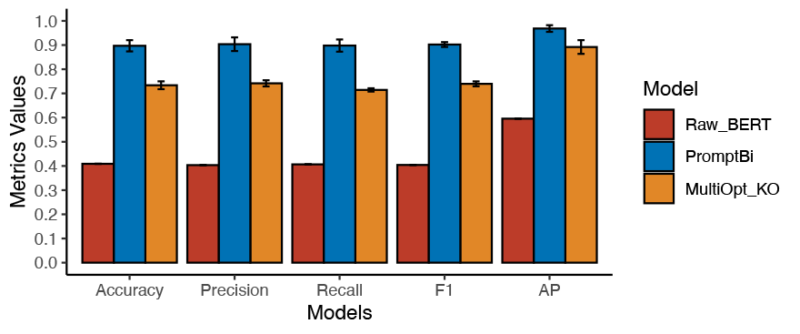
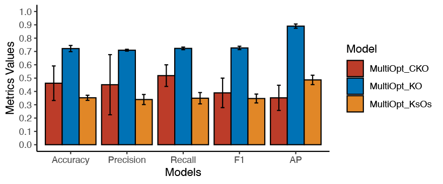

# SynPL: a zero-shot language prompt model to process multiple-choice questions on synonyms

[](https://colab.research.google.com/github/KaikePing/SynPL/blob/main/src/Prompt_Bi.ipynb)

- [SynPL: a zero-shot language prompt model to process multiple-choice questions on synonyms](#synpl-a-zero-shot-language-prompt-model-to-process-multiple-choice-questions-on-synonyms)
  - [Overview](#overview)
    - [Background](#background)
    - [Approaches](#approaches)
    - [Results](#results)
    - [Findings](#findings)
  - [Datasets](#datasets)
  - [Question structure](#question-structure)
  - [*AutoModelForMultipleChoice* model](#automodelformultiplechoice-model)
    - [Three input patterns](#three-input-patterns)
    - [Finetune](#finetune)
    - [Results](#results-1)
  - [Fill-mask prompt model](#fill-mask-prompt-model)
    - [Background](#background-1)
    - [Prompt idea](#prompt-idea)
    - [Finetune](#finetune-1)
    - [Definition of accuracy](#definition-of-accuracy)
    - [Data processing](#data-processing)
    - [Results](#results-2)
  - [MultiOpt VS Prompt](#multiopt-vs-prompt)
    - [Results](#results-3)
  - [Requirements](#requirements)
  - [Model files](#model-files)

## Overview

### Background

Multiple-choice questions are a classic section in exams. When taking a language test such as TOEFL®, some synonym questions need you to select the "best" choice among a set of four options of words or phrases that is the closest meaning to a "keyword" in the context of a reading passage.

Here my objective is to build language models to process this kind of questions automatically.

### Approaches

I developed 2 kinds of language models to solve this problem. 

The first is to use the `AutoModelForMultipleChoice` pre-trained model from [🤗TRANSFORMERS](https://huggingface.co/transformers). This is a generic model with a multiple-choice head, which yields scores of inputs in a given selection. We select ID with max scores as the most plausible inputs.

The second is to build a prompt for the classic fill-mask model, so that this multiple-choice task can be formulated as a masked language modeling problem, which is what pre-trained models like BERT are designed for in the first place.

[Figure 1](#fig1) shows the schematic. Where:

- **MultiOpt_KO** model is finetuned *AutoModelForMultipleChoice* pre-trained BERT model with `Keyword [SEP] Options` pattern as input
- **PromptBi** model is the classic fill-mask model with prompt

<i id="fig1"></i>


**Fig 1.** Schematic for 2 models

### Results

[Figure 2](#fig2) is the final result of these 2 models. Where **"Raw BERT"** is un-finetuned *AutoModelForMultipleChoice* pre-trained BERT model.

<i id="fig2"></i>



**Fig 2.** The Final result of the 2 models

### Findings

- Same as humans, models don't need contexts for this kind of synonym questions
- Prompt has the best performance in terms of accuracy, input conciseness, and the amount of training data needed (Because it can be finetuned on other datasets first).
- To my best knowledge, prompt models are a novel way of language models for these kinds of problems.

## Datasets

Two Datasets are used in this project.

- A total of 454 synonym multiple-choice questions from the TOEFL® test
- [WordNet](https://www.nltk.org/howto/wordnet.html)

Due to copyright issues, I can't share the TOEFL® test dataset here.

## Question structure

A typical example of synonym multiple-choice questions from the TOEFL® test would be like this:

> 45\. Coincident with concerns about the accelerating loss of species and habitats has been a growing **appreciation** of the importance of biological diversity, the number of species in a particular ecosystem, to the health of the Earth and human well-being.  
>
> Q: The word "appreciation" is closest in meaning to which of following?  
>
> A. ignorance  
> B. recognition  
> C. tolerance  
> D. forgiveness
>
> Ans: B

It consists of 4 parts: **Context**, **Question**, 4 **Options**, and the **Answer**. We can transform those strings via Python's [`re`](https://docs.python.org/3/library/re.html) library into a structured data frame.

|   ID | Context                                           | Question                                          | Opt1      | Opt2      | Opt3          | Opt4        | Ans  |
| ---: | :------------------------------------------------ | :------------------------------------------------ | :-------- | :-------- | :------------ | :---------- | :--- |
|    0 | Most of these leaders were involved in public ... | The word "representative" is closest in meanin... | typical   | satisfied | supportive    | distinctive | A    |
|    1 | In the United States, Louis Comfort Tiffany (1... | The word "prized" is closest in meaning to whi... | valued    | universal | uncommon      | preserved   | A    |
|    2 | The Art Nouveau style was a major force in the... | The word "overtaken" is closest in meaning to ... | surpassed | inclined  | expressed     | applied     | A    |
|    3 | During most of their lives, surge glaciers beh... | The word "intervals" is closest in meaning to ... | records   | speeds    | distances     | periods     | D    |
|    4 | The increasing water pressure under the glacie... | The word "freeing" is closest in meaning to wh... | pushing   | releasing | strengthening | draining    | B    |

## *AutoModelForMultipleChoice* model

This is a generic model class built in [🤗TRANSFORMERS](https://huggingface.co/transformers) that will be instantiated as a model class with a multiple-choice head. Read the document [here](https://huggingface.co/transformers/model_doc/auto.html#automodelformultiplechoice).

I used **BERT** as the base model. Its input is a set of four arrays loaded in an array, and the output/label is the numeric version of the answer — namely encode [A, B, C, D] as [0, 1, 2, 3]. So we can try to build the input in 3 different patterns and make a comparison of which input pattern is better. See an illustration below.

### Three input patterns

There are 3 input patterns we can try to build and then feed into the model:

1. `Context [SEP] Keyword [SEP] Options` - **MultiOpt_CKO**
1. `Keyword [SEP] Options` - **MultiOpt_KO**
1. `Keyword sentence [SEP] Option sentences` - **MultiOpt_KsOs**


**Fig 3.** Diagram of 3 input patterns. *Where **C** stands for **Context**, **K** stands for **Keyword**, **O** stands for **Options**, **Ks** stands for **Keyword sentence** and **Os** stands for **Option sentences**.*

### Finetune

I divided each dataset 70% as train data and 30% as test data with the same random seed. Each model was finetuned 5 times with different random initial values.

### Results

[Table 1](#tab1) and [Figure 4](#fig4) show the mean accuracies for 3 models.

<i id="tab1"></i>

**Table 1.** Evaluation Metrics for 3 *AutoModelForMultipleChoice* Models

| Model         | Accuracy | Precision | Recall | F1     | AP     |
| ------------- | -------- | --------- | ------ | ------ | ------ |
| MultiOpt_CKO  | 46.16%   | 0.4503    | 0.5186 | 0.3891 | 0.3520 |
| MultiOpt_KO   | 72.17%   | 0.7095    | 0.7230 | 0.7264 | 0.8902 |
| MultiOpt_KsOs | 35.23%   | 0.3393    | 0.3490 | 0.3468 | 0.4865 |

**MultiOpt_KO** (the *Keyword [SEP] Options* pattern) got the best result. Not only has it the highest accuracy but also is the most robust one that achieved almost consistent prediction performance when trained from different initializations.

<i id="fig4"></i>



**Fig 4.** Accuracy(%) of 3 Models

It actually adheres to our intuitions that when doing TOEFL® synonym multiple-choice questions, most of the time we don't have to read the context. By only examining the keyword and options, we can still select the best choice out.

## Fill-mask prompt model

This 70% of accuracy seems mediocre, but we can't raise its performance to the next level due to the lack of enough data for finetuning. However, as declared above, giving the context is kind of unnecessary, we may try to build a prompt to improve our model.

We can design a template that contains relationships among synonyms as a prompt. In this way, we can use other data to finetune language models and perform a zero-shot on this TOEFL® dataset.

### Background

Prompts are some small templates inserted into the inputs, with the aim that tasks such as text classification can be transformed back into a pre-trained language model's original form — a fill-mask problem.

For example, if you get a text classification problem to grade a movie review "The drama discloses nothing", then you can insert a text "It was ____" into the end of this review. After executing your model, you just need to examine logit scores of "terrible" and "great", so that you can determine whether this review is positive or negative.


**Fig 5.** A typical example of using a prompt

You can read [Gao's post](https://thegradient.pub/prompting/) for more information.

### Prompt idea

A simple idea is to build a template like this: "**A is close in meaning to B.**", where A is an English word that appears in any synonym datasets, and B is one of A's synonyms. Here I used the [WordNet](https://www.nltk.org/howto/wordnet.html) dataset.

This prompt can be performed like this on the TOEFL® dataset:

- First, we let the keyword in the question be **A**
- Second, we mask **B**
- Last, execute the model, extract the logit scores for 4 options, and then decided the best choice with the max score

### Finetune

We still need to finetune the model with this prompt, because we should let the model know that it's facing a synonym problem. See [Figure 6](#fig6) and [Table 2](#tab2) for how this step can boost its performance.

<i id="fig6"></i>


**Fig 6.** An example of before and after finetuning.
*Here you can see after finetuning, its output words are more like synonyms.*

<i id="accuracy"></i>
### Definition of accuracy

I re-defined the definition of accuracy during this finetuning. Since many words have different meanings and each meaning can have multiple synonyms, so I gathered all synonyms of one word as a list. as long as any of top N (N=1, 2, 3, 5, 10) words predicted by the model falls into this list, I count it as **one** successful prediction.

### Data processing

I eliminated data where all phrases along with words that the tokenizer doesn't know. This is because there is only one [MASK] token in my designed template. Those words or phrases may take more than one masked token positions, which would have a negative influence on models. And the model can never predict them successfully.

Last but not least, synonyms are a mutual thing. **A is close in meaning to B** also means **B is close in meaning to A**. This is obvious to humans, but maybe not to a language model. Switching the A and B can make models better understand this synonym task. See [Table 2](#tab2) for how this step can boost its performance.

### Results

In conclusion, there are 3 models in this part.

1. **Raw_BERT** - un-finetuned raw BERT model with prompt
2. **Prompt_Uni** - finetuned prompt model **without** switching the position of A and B
3. **Prompt_Bi** - finetuned prompt model **with** switching the position of A and B

<i id="tab2"></i>

**Table 2.** Accuracy of prompt models

| Model      | Top 1  | Top 2  | Top 3  | Top 5  | Top 10 |
| :--------- | :----- | :----- | :----- | :----- | :----- |
| Raw_BERT   | 5.51%  | 9.68%  | 12.24% | 15.47% | 20.48% |
| Prompt_Uni | 12.13% | 33.12% | 44.34% | 55.39% | 65.13% |
| Prompt_Bi  | 13.01% | 43.24% | 53.12% | 64.93% | 74.12% |

<i id="fig7"></i>


**Fig 7.** Accuracy of prompt models. *Check definition of accuracy [here](#accuracy).*

Below are some other metrics.
| Model      |    N | Recall |     F1 |
| :--------- | ---: | -----: | -----: |
| Raw_BERT   |    1 | 0.0275 | 0.0522 |
| Prompt_Uni |    1 | 0.0587 | 0.1051 |
| Prompt_Bi  |    1 | 0.0662 |  0.117 |
| Raw_BERT   |    2 | 0.0484 | 0.0883 |
| Prompt_Uni |    2 | 0.1661 | 0.2494 |
| Prompt_Bi  |    2 | 0.2101 | 0.2958 |
| Raw_BERT   |    3 | 0.0612 | 0.1091 |
| Prompt_Uni |    3 | 0.2179 | 0.3035 |
| Prompt_Bi  |    3 | 0.2643 | 0.3458 |
| Raw_BERT   |    5 | 0.0774 |  0.134 |
| Prompt_Uni |    5 | 0.2755 | 0.3552 |
| Prompt_Bi  |    5 | 0.3214 | 0.3913 |
| Raw_BERT   |   10 | 0.1024 |   0.17 |
| Prompt_Uni |   10 | 0.3367 | 0.4024 |
| Prompt_Bi  |   10 | 0.3745 | 0.4283 |

## MultiOpt VS Prompt

Finally, let's see how those two kinds perform on the TOEFL® dataset.

We select 3 models to compare.

1. **Raw_BERT** - un-finetuned raw BERT prompt model
2. **MultiOpt_KO** - finetuned *AutoModelForMultipleChoice* model with `Keyword [SEP] Options` as input pattern
3. **Prompt_Bi** - finetuned prompt model **with** switching the position of A and B

These models all use the same test data, which means data where all phrases along with words that the tokenizer doesn't know are eliminated.

### Results

[Table 3](#tab3) and [Figure 2](#fig2) show how these models perform on the TOEFL® dataset.

<i id="tab3"></i>

**Table 3.** Metrics of 3 final models

| Model       | Accuracy | Precision | Recall | F1     | AP     |
| :---------- | :------- | :-------- | :----- | :----- | :----- |
| Raw_BERT    | 40.88%   | 0.4034    | 0.4066 | 0.4041 | 0.5956 |
| MultiOpt_KO | 73.18%   | 0.7385    | 0.7217 | 0.7341 | 0.8894 |
| Prompt_Bi   | 89.69%   | 0.9035    | 0.8977 | 0.9020 | 0.9683 |

## Requirements

```{}
🤗 transformers==4.10.1
🤗 datasets==1.12.1
nltk==3.6.3
```

## Model files

- [src/MultiOpt_CKO.py](src/MultiOpt_CKO.py): Trainer for MultiOpt_CKO model.
- [src/MultiOpt_KO.py](src/MultiOpt_KO.py): Trainer for MultiOpt_KO model.
- [src/MultiOpt_KsOs.py](src/MultiOpt_KsOs.py): Trainer for MultiOpt_KsOs model.
- [src/MultiOpt_KO_PickVal.py](src/MultiOpt_KO_PickVal.py): Trainer for MultiOpt_KO model but with test data for final comparison (others are train data).
- [src/Prompt_Uni.py](src/Prompt_Uni.py): Trainer for Prompt_Uni model.
- [src/Prompt_Bi.py](src/Prompt_Bi.py): Trainer for Prompt_Bi model.
- [src/Prompt_Bi.ipynb](src/Prompt_Bi.ipynb): Notebook for a example of training the Prompt_Bi model. [](https://colab.research.google.com/github/KaikePing/SynPL/blob/main/src/Prompt_Bi.ipynb)
